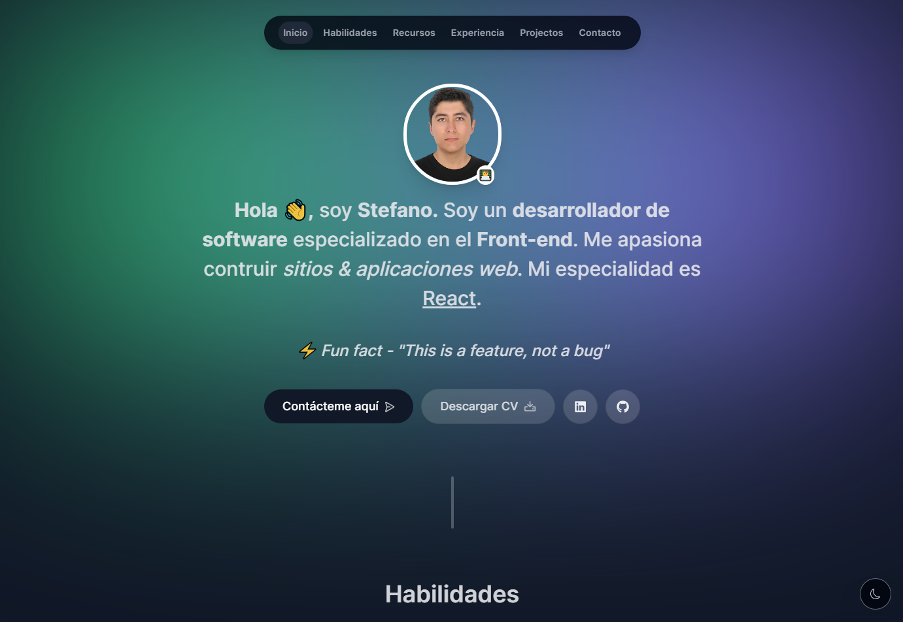

# Portfolio



### Instalación

Clona el repositorio y navega hasta el directorio:

```bash
git clone https://github.com/StefanoP21/portfolio.git
```

### Instala las dependencias:

```bash
npm install
#or
yarn add
```

### Variables de Entorno

Cree un archivo .env en la carpeta raíz de su proyecto y añada sus variables. Consulte .env.template para obtener ayuda.

### Ejecución en modo de desarrollo

Para iniciar la aplicación en modo de desarrollo, ejecuta:

```bash
npm run dev
#or
yarn dev
```

### Tecnologías

- [TypeScript](https://www.typescriptlang.org/)
- [React](https://es.react.dev/)
- [Next.js](https://nextjs.org/)
- [Tailwind CSS](https://tailwindcss.com/)
- [Framer Motion](https://www.npmjs.com/package/framer-motion)
- [React Email](https://react.email/)
- [Resend](https://resend.com/)

### Autor

- [Stefano Palomino](https://github.com/StefanoP21)

### Licencia

Este proyecto está disponible para su uso bajo la Licencia MIT.
